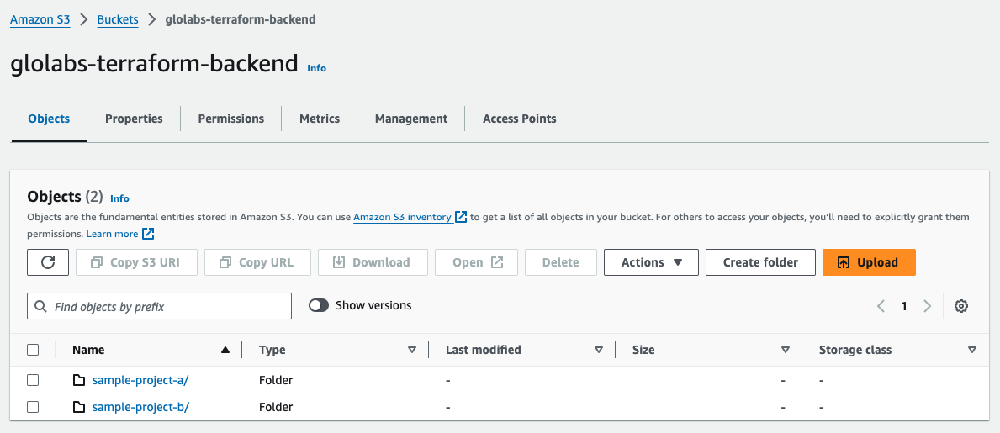
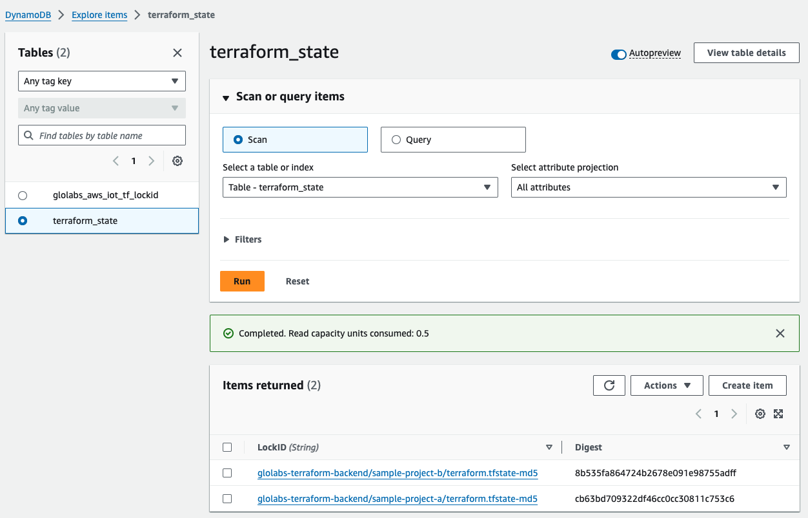

# terraform-backend-s3
___

## Overview
This project creates the AWS infrastructure required to use S3 as a Terraform remote backend. Run
this once before any other Terraform project — the resulting S3 bucket and DynamoDB table can serve
an unlimited number of projects.

**S3** stores the Terraform state file centrally, providing a single source of truth across runs and
contributors. Versioning is enabled so every state change is preserved and can be rolled back.
State is encrypted at rest using a dedicated KMS key. State locking uses S3's native lock file
support (`use_lockfile = true`), eliminating the need for a separate DynamoDB table.

## Before You Begin

This project uses **AWS IAM Identity Center** (formerly AWS SSO) for authentication. Identity Center
issues short-lived temporary credentials on login — no long-lived access keys are needed. Terraform
uses those credentials to create the backend infrastructure.

### 1. Enable IAM Identity Center
1. In the AWS console search for **IAM Identity Center** and open it
2. Click **Enable** — this is a one-time setup per AWS account
3. AWS will prompt you with: _"This account will be the management account of your organization."_
   This is expected. IAM Identity Center requires AWS Organizations. For a single-account personal
   setup this has no practical impact — click through and confirm.

### 2. Create a Permission Set
A Permission Set defines what actions are allowed when you log in with this profile. This one grants
the permissions Terraform needs to create all resources in this project: IAM roles and
policies; S3 bucket and its configuration; DynamoDB table; and KMS key.

1. IAM Identity Center → **Permission sets** → **Create permission set**
2. Choose **Custom permission set**
3. Under **Inline policy**, paste the contents of [`bootstrap-permission-set-policy.json`](bootstrap-permission-set-policy.json)
   > The S3 actions in this policy are scoped to `arn:aws:s3:::*` because the bucket name
   > is a user-supplied variable — it is not known at the time the permission set is created.
   > All other statements are scoped to their specific resource ARNs.
4. Click **Next** → name it `TerraformBootstrap` → **Create**

### 3. Create a User in Identity Center
1. IAM Identity Center → **Users** → **Add user**
2. Use `terraform-admin` as the username and enter your email address for the remaining required fields
3. You will receive an email to activate the account — complete that before continuing

### 4. Assign the User to Your Account
1. IAM Identity Center → **AWS accounts** → select your account
2. Click **Assign users or groups** → select your user → select the `TerraformBootstrap` permission set
3. Click **Submit**

### 5. Configure the AWS CLI
```bash
aws configure sso
```
When prompted:
```
SSO session name:               terraform-admin
SSO start URL:                  https://<YOUR-SSO-PORTAL>.awsapps.com/start
SSO region:                     us-east-1
SSO registration scopes:        sso:account:access  ← press Enter to accept the default
SSO account ID:                 <YOUR AWS ACCOUNT ID>
SSO role name:                  TerraformBootstrap
CLI default client Region:      us-east-1
CLI default output format:      json
CLI profile name:               terraform-admin
```
Your SSO start URL is shown on the IAM Identity Center dashboard under **Settings**.

### 6. Have the following info handy
You will be prompted for these values when running Terraform.
Alternatively, create a `terraform.tfvars` file — do not check it into git.
```
aws_account_id    = "<YOUR AWS ACCOUNT ID>"
aws_region        = "us-east-1"
s3_bucket         = "<YOUR-ORG>-tf-state"
bootstrap_profile = "terraform-admin"
github_org        = "<YOUR-GITHUB-ORG>"
```

## Create Your Terraform Backend
1. Clone this project
2. Log in with your bootstrap profile
```bash
aws sso login --profile terraform-admin
export AWS_PROFILE=terraform-admin
```
> SSO sessions expire after 8–12 hours. If you get authentication errors on a later run,
> re-run both commands above to refresh your credentials.

3. Execute Terraform commands
```bash
cd terraform-backend-s3
terraform init
terraform plan
terraform apply
```
That's it. Terraform will create the S3 bucket, KMS key, and GitHub OIDC provider.
You should now have a fully configured remote backend ready for use by any number of projects.

## Using This Backend in Your Own Project

Follow these steps once per downstream project. Your project lives in its own separate repository — it does not need to be inside this repo.

### 1. Register the project

From the root of this (`terraform-backend-s3`) repository, run:

```bash
./new-project.sh <project-name> <github-repo-name>
```

Example:

```bash
./new-project.sh my-api my-api-repo
```

The script creates an IAM role and state-access policy for the project, then prints two things you need in the steps below:

- **`backend.conf` block** — the S3 backend configuration (safe to commit, no credentials)
- **Role ARN** — the IAM role your project will assume when provisioning resources

### 2. Configure main.tf

At the top of your `main.tf`, add the `terraform` backend block and the AWS provider.
The `backend "s3"` block must be empty — all values come from `backend.conf` at init time.
The `assume_role` block tells Terraform to use the project IAM role when provisioning resources.

```hcl
# main.tf
terraform {
  backend "s3" {}
}

provider "aws" {
  region = var.aws_region

  assume_role {
    role_arn = var.role_arn
  }
}
```

If you already have a `provider "aws"` block, just add the `assume_role` section to it.

### 3. Create backend conf files

Create one file per environment in the same directory as your `main.tf`, using the block
printed by `new-project.sh`. Change only the `key` between files:

```
your-repo/backend-dev.conf        # Terraform at the repo root
your-repo/backend-staging.conf
your-repo/backend-prod.conf

your-repo/infra/backend-dev.conf  # Terraform in a subdirectory
your-repo/infra/backend-staging.conf
your-repo/infra/backend-prod.conf
```

```hcl
bucket       = "<YOUR-ORG>-tf-state"
use_lockfile = true
kms_key_id   = "<KMS-KEY-ARN>"
region       = "us-east-1"
encrypt      = true
key          = "my-api/dev/terraform.tfstate"   # change env per file
```

These files are **safe to commit** — they contain no credentials.

### 4. Create variables.tf

These are files you create in your own project repository. You can use the files in
[`examples/sample-project-a/`](examples/sample-project-a/) as a working reference.

Create `variables.tf` in the same directory to declare the four variables the provider
and backend depend on:

**`variables.tf`** — declare the four input variables the provider and backend depend on.
Create this file if it doesn't exist yet:

```hcl
variable "aws_account_id" {
  type        = string
  description = "AWS account ID where project resources are deployed"
}

variable "aws_region" {
  type        = string
  description = "AWS region where project resources are deployed"
}

variable "project_name" {
  type        = string
  description = "Short unique identifier for the project"
}

variable "role_arn" {
  type        = string
  description = "ARN of the IAM role to assume when provisioning project resources"
}
```

### 5. Create terraform.tfvars

Create `terraform.tfvars` in the same directory. **Do not commit this file** — add it to your `.gitignore`.

```hcl
aws_account_id = "<YOUR AWS ACCOUNT ID>"
aws_region     = "us-east-1"
project_name   = "my-api"
role_arn       = "<ROLE_ARN_FROM_NEW_PROJECT_SH>"
```

### 6. Initialise and run

```bash
aws sso login --profile terraform-admin
export AWS_PROFILE=terraform-admin
terraform init -backend-config=backend.conf
terraform plan
terraform apply
```

> SSO sessions expire after 8–12 hours. If you see authentication errors, re-run
> `aws sso login --profile terraform-admin && export AWS_PROFILE=terraform-admin` to refresh your credentials.

### 7. Set up GitHub Actions (optional)

Copy the template workflow into your project repository:

```bash
cp <path-to-terraform-backend-s3>/examples/.github/workflows/terraform.yml \
   .github/workflows/terraform.yml
```

In your GitHub repository go to **Settings → Secrets and variables → Actions → Variables** and add:

| Variable | Value |
|---|---|
| `TF_ROLE_ARN` | Role ARN printed by `new-project.sh` |
| `AWS_ACCOUNT_ID` | Your AWS account ID |
| `AWS_REGION` | e.g. `us-east-1` |
| `TF_PROJECT_NAME` | Your project name (e.g. `my-api`) |

If your Terraform root is in a subdirectory (e.g. `infra/`), uncomment and set `working-directory` in the workflow file.

Commit and push. The workflow runs `terraform plan` on every PR and `terraform apply` on merge to `main`.

> **Recommended:** Enable branch protection on `main` so that `terraform apply` only runs
> after a plan has been reviewed and approved via PR.

---

## See it in action

The `examples/` directory contains two working sample projects that demonstrate the full setup
described above. See [examples/README.md](examples/README.md) for a walkthrough.

Once you are done your S3 bucket should look something like:




and your DynamoDB table should look something like:




## Multi-environment projects

The S3 state key is structured as `<project-name>/<env>/terraform.tfstate`, so a single bucket
cleanly holds state for every project and environment without any naming collisions.

The IAM role created by `new-project.sh` (`tf-<project-name>`) is **project-scoped** — it grants
access to all state keys under that project prefix, regardless of environment. Dev and prod
deployments share the same role.

To deploy a project to multiple environments, create one `backend.conf` file per environment:

```
backend-dev.conf
backend-staging.conf
backend-prod.conf
```

Each file is identical except for the `key`:

```hcl
# backend-prod.conf
bucket       = "<YOUR-ORG>-tf-state"
use_lockfile = true
kms_key_id   = "<KMS-KEY-ARN>"
region       = "us-east-1"
encrypt      = true
key          = "<project-name>/prod/terraform.tfstate"
```

Initialise Terraform with the appropriate file for each environment:

```bash
terraform init -backend-config=backend-prod.conf
terraform apply -var-file=prod.tfvars
```

If you need strict environment isolation at the IAM level (e.g. prevent a dev deployment from
touching prod state), run `new-project.sh` with an environment suffix:

```bash
./new-project.sh my-api-prod my-api-repo
```

This creates a separate `tf-my-api-prod` role whose state policy is scoped exclusively to
`my-api-prod/*`.

## Good things to know
### How to start over
You may have created your state bucket and added some test projects but want to start fresh.
You might think that you can simply run ```terraform destroy``` and, boom, you're done.
However, that's not the case. 

Due to the proper configuration of managing remote state, we are keeping a history in s3 which prevents
```terraform destroy``` from completing successfully due to the s3 versions that are saved.
To get past this you have to delete the versions manually. To do so:
1. In s3 click on the bucket containing your state.
2. Click on the Object you wish to delete. 
3. Click on the "Show versions" slider near the search bar.
4. To "select all" click the checkbox near "Name".
5. Click "Delete".
6. Scroll to the bottom. Type "permanently delete" in the text box and click "Delete objects".

Follow the previous steps to delete all other objects from the bucket.

Once the bucket is empty, run `terraform destroy` to remove all remaining resources
(KMS key, OIDC provider, and the now-empty S3 bucket).